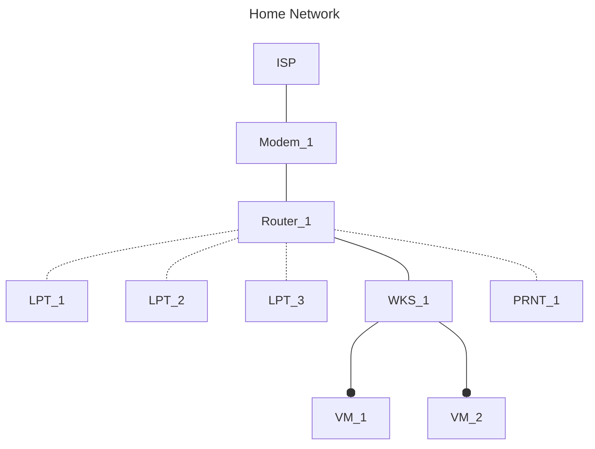

# Abstract

## Preface
This repository is designed to utilize personal projects for professional growth. Here, I will document the steps taken, lessons learned, and future plans for my projects in order to showcase my abilities and learned skills for independent review. 
The documentation will have a mix of instructions and personal accounts to demonstrate my professional writing skills and thought processes. Genuinely, thank you for your time and patience.
> [!Note]
> I would like to add a disclaimer that there will be gaps in information and incomplete aspects due to both time constraints and using examples from before the decision was made to document my journey. Additionally, my report writing skills come from
> EMT experience, and the "sound" of my writing may not be in line with what the IT field expects.

## Home Network
### Overview
The home network is designed to be a sandbox for hands-on practice with the material in Network+. The network itself will be used to complete everyday tasks and will provide basic digital security for residents and guests inside the home.

### Topology

### Inventory
1. End User Devices
  - HP Laptop (LPT_1)
    - Windows 10
  - ThinkPad Laptop (LPT_2)
    - Kali Linux
  - Toughbook Laptop (LPT_3)
    - Windows 10
  - Desktop Workstation (WKS_1)
    - Windows 10
  - Virtual Machine (VM_1)
    - Windows 10
  - Virtual Machine (VM_2)
    - Ubuntu Linux
  - HP Printer (PRNT_1)
2. Networking Devices
  - Netgear Wifi Router (Router_1)
  - Arris Modem (Modem_1)

### Network Configuration
1. Address
   - 10.0.0.0
2. DHCP
   - Reservation
     - Router_1 10.0.0.1
     - WKS 10.0.0.11
   - IP Pool
     - 10.0.0.20 - 10.0.0.50
   - Lease Time
     - 24 hours
   - APIPA
     - Enabled
3. Wireless
   - 2.4G "Home_Net_2.4"
     - Passkey: "Password123"
   - 5G "Home_Net_5"
     - Passkey: "Password123"
5. DNS
   - Received automatically from ISP
6. Internet Routable IP
   - Received dynamically from ISP
